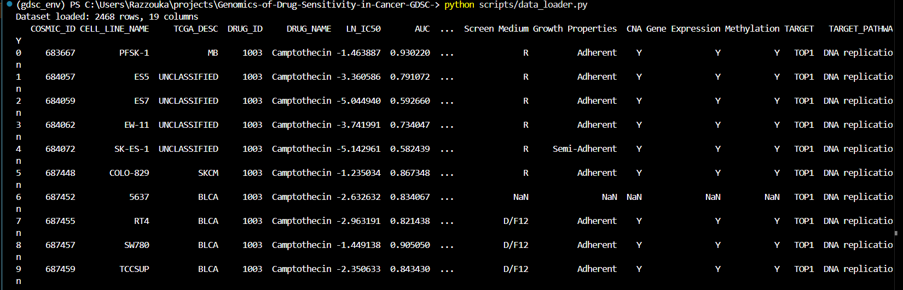

# Genomics of Drug Sensitivity in Cancer (GDSC)
> Project overview: Coursework project for Data Engineering Management analysing the Genomics of Drug Sensitivity in Cancer (GDSC) dataset. Includes environment setup, reproducible workflows, data cleaning, and exploratory analysis.

## Dataset information 
- **Source**: https://www.kaggle.com/datasets/elifnuryaygin/genomics-of-drug-sensitivity-in-cancer-gdsc
- **Content**: It provides access to comprehensive drug sensitivity and genomic data, supporting research in cancer treatment and drug discovery.
- **Features and size**: (2468 rows and 19 columns) Each row represents a single experimental measurement of drug response in one cancer cell line. The features describe cell lines metadata, drug metadata, response metrics omics availability flags.
- **Dataset link**: You can access the dataset here: https://drive.google.com/drive/folders/1Zgo10S1u2FKUD23Eq-vjRrAPvQBgCwnj?usp=drive_link
  
  > Note: The dataset is hosted externally and is linked above due to size constraints for storage on GitHub.
  
## Repository Structure
Genomics of Drug Sensitivity in Cancer (GDSC)  
├── screenshots/ # Screenshots of script output  
├── scripts/data_loader.py # Python scripts  
├── README.md # documentation  
├── pyproject.toml # Poetry dependencies  
└── poetry.lock # locked versions

## Requirements
To reproduce this project, you need:

### System
- Python >= 3.11 (recommended)
- Conda (for environment management)
- Poetry (for dependency management)

### Python Packages
The following key packages are used:
- **pandas** → data loading, cleaning, type casting
- **matplotlib** → plotting and visualization
- **jupyterlab** → interactive notebooks
- **wget** → downloading files

## Environment Setup
1. Create and activate a Conda environment:

```powershell
   conda create -n gdsc_env python=3.13 pip -y
   conda activate gdsc_env
```
2. Install dependencies with Poetry:

```powershell
   pip install poetry
```
3. Run the script:

```powershell
   python scripts/data_loader.py
```

## Output
### First 10 rows of the dataset

### Reproducibility check
- Cleaned dataset saved to `data/gdsc_clean.csv`.
- Reloaded with `pandas.read_csv`; structure preserved.
- Dtypes (after casting): identifiers as integers, metrics as floats, metadata as string/category, flags as boolean.


## EDA Notebook
[Click here to view the rendered EDA on nbviewer](https://nbviewer.org/github/razzouka/Genomics-of-Drug-Sensitivity-in-Cancer-GDSC-/blob/main/notebooks/final_EDA.ipynb)
