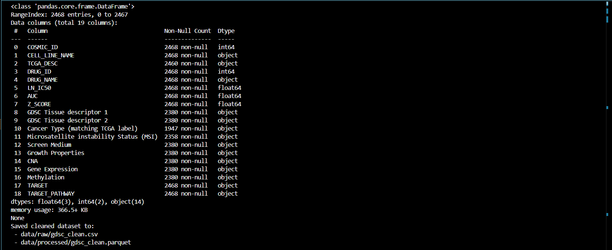

# Genomics of Drug Sensitivity in Cancer (GDSC)
> Project overview: Coursework project for Data Engineering Management analysing the Genomics of Drug Sensitivity in Cancer (GDSC) dataset. Includes environment setup, reproducible workflows, data cleaning, and exploratory analysis.

## Dataset Information
- **Source:** [Kaggle Dataset](https://www.kaggle.com/datasets/elifnuryaygin/genomics-of-drug-sensitivity-in-cancer-gdsc)  
- **Content:** Drug sensitivity and genomic data for cancer research.  
- **Size & Features:** 2,468 rows × 19 columns, including cell line metadata, drug metadata, response metrics, and omics availability flags.  
- **External Storage:** [Google Drive Folder](https://drive.google.com/drive/folders/1Zgo10S1u2FKUD23Eq-vjRrAPvQBgCwnj?usp=drive_link)  

> Dataset hosted externally due to GitHub size constraints.

---

## Repository Structure
```
Genomics of Drug Sensitivity in Cancer (GDSC)  
  ├─ etl/                                 # ETL pipeline modules 
  │   ├─ __init__.py
  │   ├─ extract.py                       # Load dataset from Google Drive and save raw CSV
  │   ├─ transform.py                     # Clean, cast types, and save processed dataset as Parquet
  │   ├─ validate.py                      # Validate data (duplicates, types, missing values)
  │   ├─ load.py                          # Load up to 100 rows to PostgreSQL 
  │   └─ main.py                          # CLI to run any step or the full ETL
  ├─ notebooks/                           # Jupyter notebooks
  │   └─ final_EDA.ipynb
  ├─ screenshots/                         # Screenshots of outputs
  ├─ data/                                # raw/processed data (ignored by git)
  ├─ README.md
  └─ pyproject.toml                       # Poetry dependencies

```

## Requirements
To reproduce this project, you need:

### System
- Python >= 3.11 (recommended)
- Conda (for environment management)
- Poetry (for dependency management)

### Python Packages
The following key packages are used:
- **pandas** → data loading, cleaning, type casting
- **matplotlib** → plotting and visualization
- **jupyterlab** → interactive notebooks
- **wget** → downloading files

## Environment Setup
1. Create and activate a Conda environment:

```powershell
   conda create -n gdsc_env python=3.13 pip -y
   conda activate gdsc_env
```
2. Install dependencies with Poetry:

```powershell
   pip install poetry
```
> All project dependencies are defined in pyproject.toml.

## ETL Pipeline Overview

The project includes a modular ETL pipeline (`etl/`):

- **Extract (`extract.py`)**: Load dataset from Google Drive and save raw CSV.
- **Transform (`transform.py`)**: Clean dataset, cast types, and save Parquet.
- **Validate (`validate.py`)**: Ensure no duplicates, correct types, no critical missing values.
- **Load (`load.py`)**: Insert up to 100 rows into PostgreSQL table.
- **Main (`main.py`)**: CLI to run any step or the full pipeline.

## Running the Pipeline (Windows)

Set environment variables in PowerShell:

```powershell
$env:GDSC_FILE_ID="<file_id>"
$env:RAW_DATA_PATH="data/raw/gdsc_raw.csv"
$env:PROCESSED_DATA_PATH="data/processed/gdsc_clean.parquet"
$env:PG_TABLE_NAME="razzouk"
$env:N_ROWS=100
$env:KEY_COLS="cosmic_id,drug_id"
```

Run a specific step:

```powershell
python etl\main.py --mode extract
python etl\main.py --mode transform
python etl\main.py --mode validate
python etl\main.py --mode load
```

Run the full pipeline:

```powershell
python etl\main.py --mode all
```

## Output
### First 10 rows of the dataset

### Reproducibility check
- Cleaned dataset saved to `data/processed/gdsc_clean.parquet`.
- Reloaded with `pandas.read_parquet`; structure preserved.
- Dtypes (after casting): identifiers as integers, metrics as floats, metadata as string/category, flags as boolean.




## Exploratory Data Analysis (EDA)

- Conducted in `notebooks/final_EDA.ipynb`.
- Analysis includes: structure assessment, missing data, duplicates, outliers, summary statistics.
- Visualizations with Seaborn and Plotly Express (grid-style plots, consistent style).

**View online:**  
[EDA Notebook on nbviewer](https://nbviewer.org/github/razzouka/Genomics-of-Drug-Sensitivity-in-Cancer-GDSC-/blob/main/notebooks/final_EDA.ipynb)
