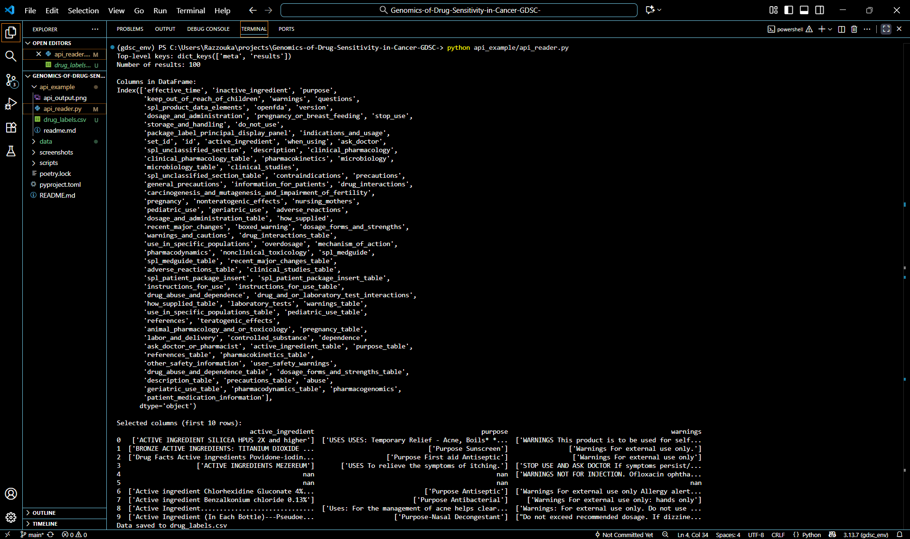

# API Example: OpenFDA Drug Label

This example demonstrates how to fetch biomedical data from the [OpenFDA Drug Label API](https://open.fda.gov/apis/drug/label/) and process it with Python and Pandas.

---

## Files
- `api_reader.py` → Python script that queries the API, explores the JSON structure, and displays selected fields.
- `api_output.png` → Screenshot of the terminal output.
- `README.md` → Documentation.

---

## Steps Performed in `api_reader.py`

1. **Define the API endpoint**  
   - URL: `https://api.fda.gov/drug/label.json?limit=100`  
   - The `limit` parameter controls how many drug entries are returned.

2. **Send GET request**  
   - Use `requests.get(url)` to fetch the data.  
   - Convert the response to a Python dictionary with `.json()`.

3. **Explore the JSON structure**  
   - Print top-level keys (`meta`, `results`).  
   - Print number of results.  
   - Print keys of the first entry to see available fields.

4. **Convert to Pandas DataFrame**  
   - Use `pd.json_normalize(data["results"])` to flatten the JSON into rows and columns.

5. **Explore DataFrame columns**  
   - Print `df.columns` to see all available fields.

6. **Display selected columns**  
   - Focus on `active_ingredient`, `indications_and_usage`, and `warnings` for clarity.

---

## Output

Below is an example of the output:
